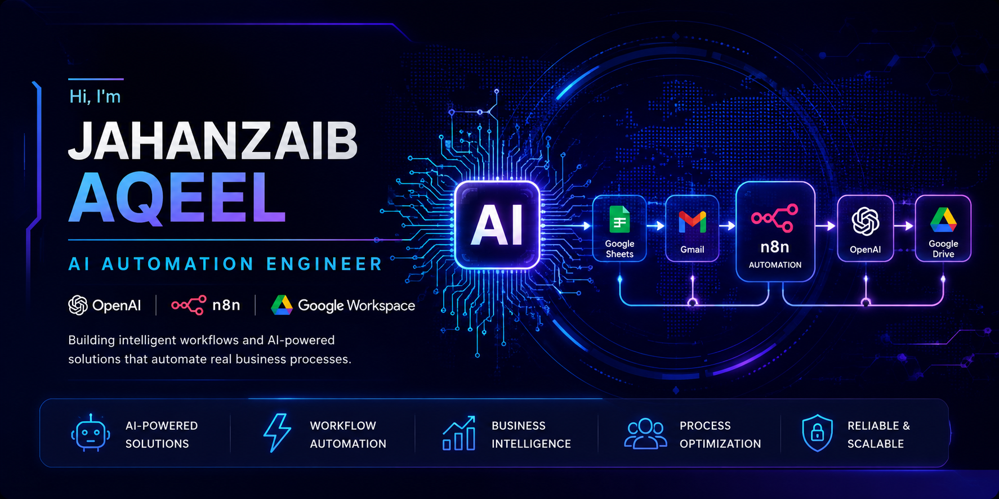

  

 

# 👋 Hi, I'm Jahanzaib Aqeel

### 🤖 AI Automation Engineer | Workflow Automation | OpenAI | n8n

I build AI-powered automation systems that help businesses reduce manual work,
streamline workflows, and improve operational efficiency.

I specialize in **OpenAI, n8n, APIs, and Google Workspace automation**, with a
focus on practical business solutions across CRM, HR, finance, customer
support, reporting, and business operations.

---

## 🚀 About Me

🎓 **BS Cyber Security Student**

🤖 **AI Automation Enthusiast**

⚡ **Workflow Automation Engineer**

💼 **Business Process Automation**

🧠 Interested in building practical AI systems that solve real business problems.

I focus on turning repetitive business processes into reliable,
AI-powered workflows.

---

## 🧩 What I Build

- 🤖 AI-powered business assistants
- 🔄 Workflow automation systems
- 📊 Automated business reporting
- 👥 CRM automation
- 🧑‍💼 HR automation
- 💰 Finance and invoice automation
- 📄 Document and contract analysis
- 📧 Gmail automation
- 📁 Google Drive automation
- 📅 Meeting and scheduling automation
- 🔌 API and webhook integrations
- 🧠 AI agent workflows

---

## 🛠️ Tech Stack

### 🤖 AI & Automation

- OpenAI / GPT
- n8n
- Prompt Engineering
- AI Agents
- Workflow Automation
- Webhooks
- REST APIs

### ☁️ Google Workspace

- Google Sheets API
- Gmail Automation
- Google Drive Automation
- Google Workspace Integrations

### 💻 Development & Tools

- HTML
- CSS
- JavaScript
- Git
- GitHub
- VS Code

---

## 🚀 Featured Portfolio

### 🤖 AI Automation Portfolio

A collection of **20 AI automation projects** covering different business
operations and workflow use cases.

**Repository:**

https://github.com/JAHANZAIB-AQEEL/AI-Automation-Portfolio

### Built With

- OpenAI
- n8n
- Google Workspace
- Webhooks
- REST APIs
- Prompt Engineering

### Areas Covered

- ✅ HR Automation
- ✅ Sales Automation
- ✅ CRM Automation
- ✅ Finance Automation
- ✅ Customer Support Automation
- ✅ Document Intelligence
- ✅ Executive Reporting
- ✅ AI Agents

---

## ⭐ Featured Projects

### 🧠 AI Multi-Agent Business Assistant

Enterprise-style AI workflow concept using multiple specialized AI agents
to support different business operations.

### 📊 AI Executive Business Reporting System

Automates the generation of business reports from structured business data.

### 📄 AI Contract & Document Analyzer

Analyzes documents and extracts important information using AI.

### 🤖 AI CRM Assistant

Automates repetitive customer relationship management tasks.

### 💰 AI Invoice Generator

Creates professional invoices through an automated workflow.

### 📅 AI Meeting Scheduler

Automates scheduling-related tasks and workflow coordination.

---

## 🎯 Core Skills

- AI Workflow Automation
- Prompt Engineering
- Business Process Automation
- OpenAI Integration
- n8n Development
- Google Workspace Automation
- CRM Automation
- HR Automation
- Sales Automation
- API Integration
- Webhook Automation
- AI Agent Workflows

---

## 🌱 Currently Learning

- Multi-Agent AI Systems
- Retrieval-Augmented Generation (RAG)
- Model Context Protocol (MCP)
- AI Agents
- Advanced n8n Automation
- Enterprise Workflow Architecture

---

## 📬 Let's Connect

### 💼 Portfolio

https://jahanzaib-aqeel.github.io/

### 🐙 GitHub

https://github.com/JAHANZAIB-AQEEL

### 📧 Email

jahanzaibaqeel6@gmail.com

### 💬 WhatsApp

https://wa.me/923247421210

---

## ⭐ Thanks for Visiting!

I'm interested in building practical AI automation solutions that solve
real business problems.

> "Building AI-powered business solutions with OpenAI and n8n."
